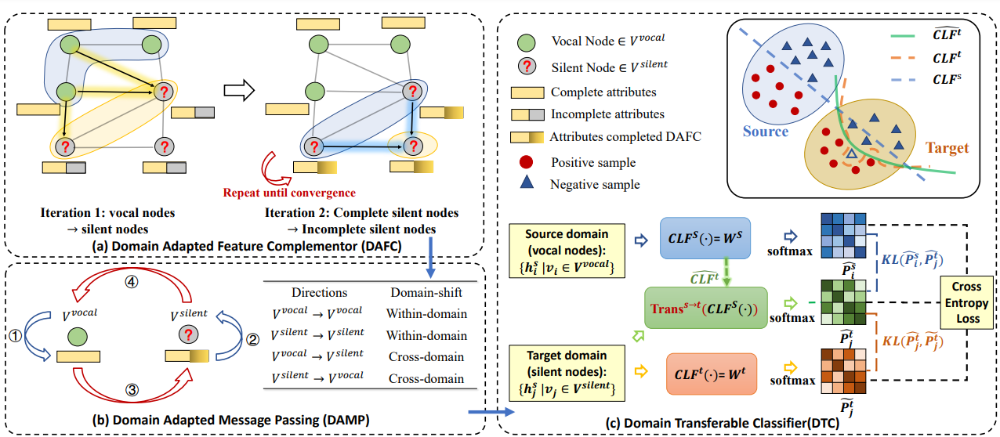

# KTGNN
Source code and datasets of the paper "Predicting the Silent Majority on Graphs: Knowledge Transferable Graph " (WWW2023) [[PDF]](https://arxiv.org/abs/2302.00873)



​																**Figure 1: Overview of KTGNN**

### Steps to run the code:

* First unzip the .rar file in *./datasets/twitter/raw/raw.rar*

  * The size of the raw dataset is too large to upload onto  the reponsitory, so we zip the original files first.
* Then run KTGNN with the following command:

  ```shell
  python3 main_twitter.py
  ```

  
